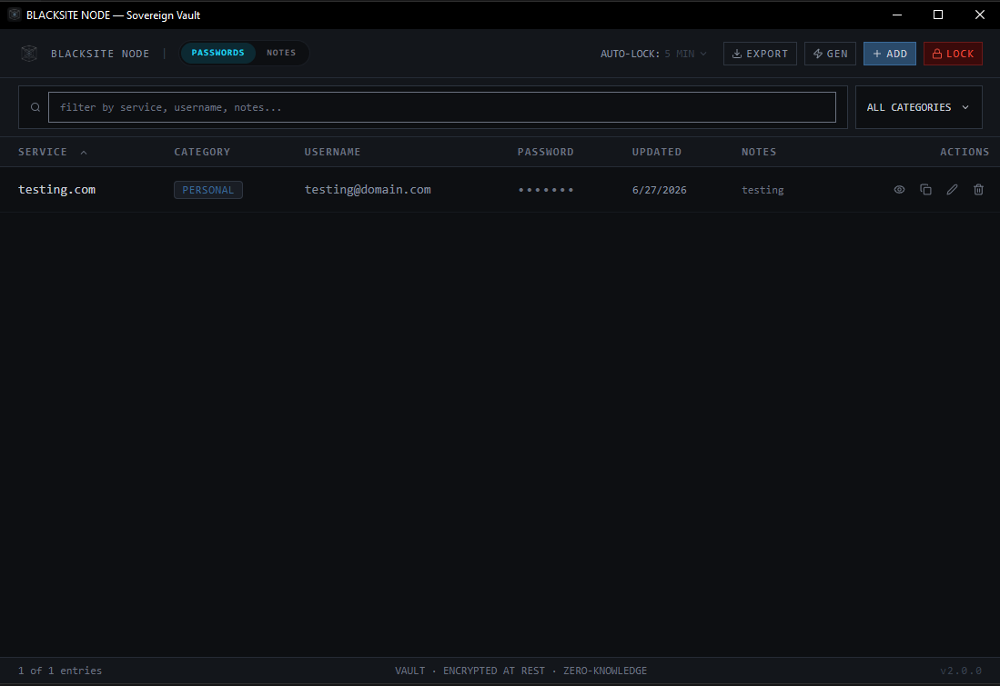
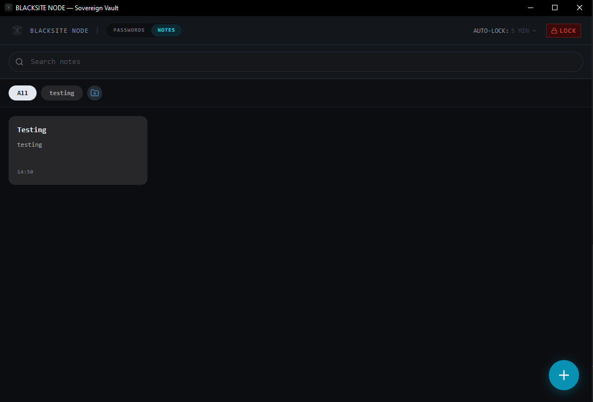
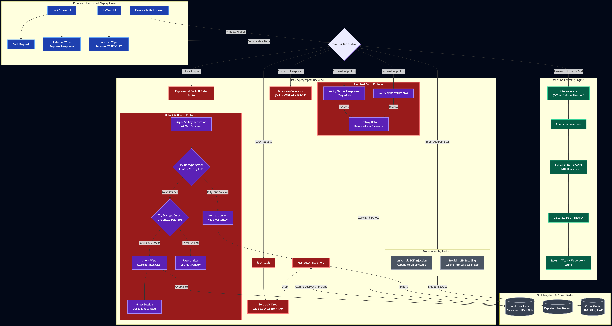
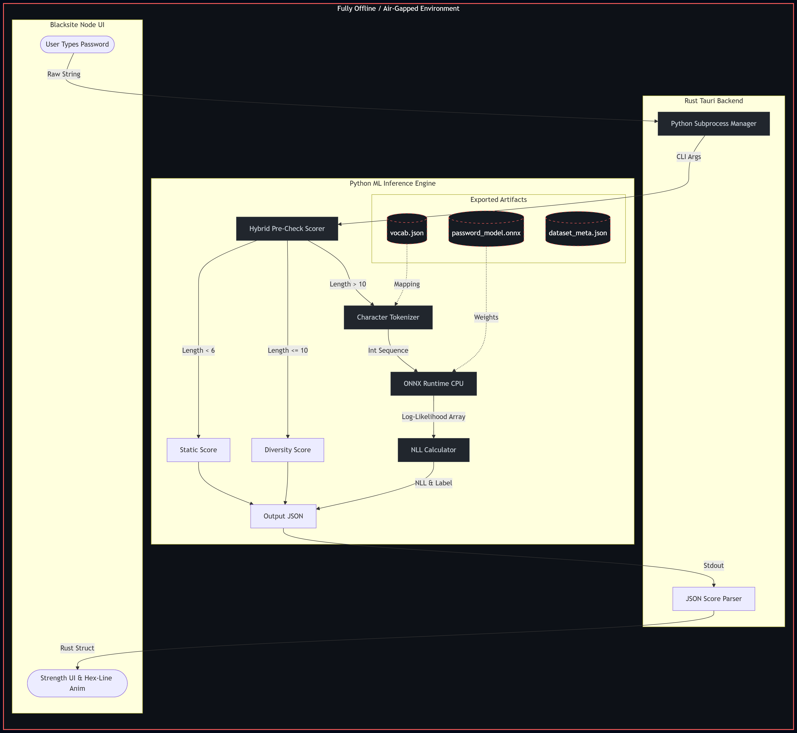

<div align="center">
  
  
  <h1>BLACKSITE NODE</h1>
  <h3>Sovereign Offline Password Manager & Secure Notepad</h3>
</div>

```
CLASSIFICATION : PERSONAL SECURITY INFRASTRUCTURE
ARCHITECTURE   : Tauri v2 · Rust · React · TypeScript · Vite · TailwindCSS
CIPHER SUITE   : Argon2id · ChaCha20-Poly1305 · OsRng CSPRNG
STORAGE        : Single encrypted .blacksite file — zero cloud, zero sync, zero trust
VERSION        : v2.0.0
```

<div align="center">
  <h3>Support the Developer</h3>
  <a href="https://ko-fi.com/matlih">
    
  </a>
</div>

<div align="center">
  <h2>100% Free, Open Source Software</h2>
  <p><b>Blacksite Node is forever free. No subscriptions. No telemetry. Zero clouds.</b></p>
</div>

<p align="center">
  <a href="https://github.com/Matlih/Blacksite-Node/releases">Releases</a> •
  <a href="#features-overview">Features</a> •
  <a href="#i-the-architecture">Architecture</a> •
  <a href="#ii-core-protocols">Protocols</a> •
  <a href="#iii-the-cryptographic-math">Cryptography</a> •
  <a href="#iv-machine-learning-engine">Machine Learning</a> •
  <a href="#v-build-instructions">Build Instructions</a> •
  <a href="#vii-distribution--deployment">Deployment</a>
</p>

<br>

<div align="center">
  
</div>

<div align="center">
  
</div>

---

## FEATURES OVERVIEW

- **Zero-Knowledge Architecture:** No cloud, no sync, no accounts. 
- **Volatile Memory Execution:** The plaintext vault and cryptographic keys exist strictly in RAM and are permanently zeroized upon lock. Data is never written to disk unencrypted.
- **Duress Protocol:** Canary passphrase triggers silent wipe and ghost session.
- **Inactivity Auto-Lock:** Configurable (1, 5, 10, 15, 30 minutes).
- **Secure Native Clipboard:** Fast native OS API clipboard with reliable 30-second local auto-clear.
- **Vault Integrity Checks:** Detects corrupted or tampered vault files via magic headers.
- **Password History:** Tracks and stores previous passwords to prevent reuse.
- **Categories:** Organize credentials using pre-made or custom categories.
- **Offline ML Password Strength (NLP Stack):** Evaluates password unpredictability dynamically using a built-in Character-Level LSTM Neural Network.
- **Diceware Passphrase Generator:** Generates highly memorable, cryptographically secure passphrases using the official BIP-39 (Bitcoin Improvement Proposal) word lists.
- **Data Portability:** Native support for encrypted `.bsx` vault backups and cross-device imports.
- **Universal & Stealth Steganography:** Hide your encrypted vault completely out of sight by weaving it into the pixels of a high-res image (LSB) or appending it to a video file (EOF).
- **Scorched Earth Wipe Protocol:** Mathematically destroy the vault and securely zeroize the file from disk using either an Internal or External wipe mechanism.
- **Cryptographic Rate-Limiting:** Exponential backoff rate limiter using Argon2id to completely neuter online brute-force attacks.
- **Secure Notes:** A native, zero-knowledge notepad interface featuring masonry grid layouts, dynamic custom folders, pinned notes, and smart time-formatting. Notes are encrypted identically to passwords.
- **Cross-Platform Readiness:** Tauri v2 architecture allows seamless compilation to Android APKs.
- **Immersive UI:** A striking, minimalist interface featuring a 3D Orbital loading screen and smooth, direct user flows.

---

## I. THE ARCHITECTURE

Blacksite Node is a fully offline, zero-knowledge password manager and secure notepad. There is no server. There is no account. There is no recovery email. The vault lives on your machine, encrypted, and the only key that exists is the one in your head... and perhaps a piece of paper.

<div align="center">
  
</div>

**Mermaid Source:** [docs/architecture/architecture_mermaid.md](docs/architecture/architecture_mermaid.md)

**Kerckhoffs's Principle**

Blacksite Node strictly adheres to **Kerckhoffs's Principle**: *The security of a cryptographic system shouldn't rely on the secrecy of the algorithm.* Even if everything about the system, except the key, is public knowledge.

Our entire architecture, cryptographic flow, and source code are 100% transparent and open-source. The security of your vault relies entirely on the mathematical strength of ChaCha20-Poly1305 and Argon2id, not on "security through obscurity."

The frontend is treated as an **untrusted display layer**. It never handles raw key material, never makes cryptographic decisions, and never sees plaintext outside of an active unlocked session. All security logic — key derivation, encryption, decryption, rate limiting, duress detection — is implemented exclusively in Rust.

**Zero-Knowledge Vault Philosophy**

The master passphrase is never stored. Not on disk. Not in memory beyond the duration of an active session. When the vault locks — whether by user action, window minimize, or process termination — the Rust `MasterKey` struct is dropped, triggering `ZeroizeOnDrop`: the 32 key bytes are overwritten with zeros before the memory is released. There is no recovery path. There is no backdoor. If the passphrase is lost, the vault is permanently inaccessible by design.

The vault file (`vault.blacksite`) contains:

```json
{
  "magic":              "BLACKSITE_NODE_v1",
  "version":            1,
  "salt":               "<base64, 16 bytes, random per vault>",
  "nonce":              "<base64, 12 bytes, random per write>",
  "ciphertext":         "<base64, ChaCha20-Poly1305 AEAD output>",
  "duress_salt":        "<base64, 16 bytes>",
  "duress_nonce":       "<base64, 12 bytes>",
  "duress_ciphertext":  "<base64, canary-key encrypted empty vault>"
}
```

The entire credential store (passwords, notes, and folders) is encrypted as a single atomic JSON blob. There is no per-entry encryption. Either the whole vault decrypts (correct passphrase) or nothing does (wrong passphrase → Poly1305 authentication failure before any plaintext is released).

**Page Visibility Lock**

The frontend registers a `visibilitychange` event listener. When the window is hidden — minimized, switched away from, or obscured — `lock_vault()` is called immediately. The Rust session is dropped, the master key is zeroized, and the view returns to the lock screen. The key does not wait for the user to explicitly lock. It is gone the moment the window is hidden.

---

## II. CORE PROTOCOLS

### The Duress Protocol (Canary Passphrase)

During vault initialization, the system generates two cryptographically independent passphrases:

- **Master Passphrase** — unlocks the vault and decrypts all stored credentials.
- **Canary Passphrase** — triggers silent vault destruction and opens a decoy empty session.

Both passphrases are derived via Argon2id with independent salts stored in the vault file. They are shown exactly once during setup and never persisted anywhere.

**Duress sequence (Rust backend):**

```
unlock_vault(canary_passphrase)
  │
  ├── Derive key from input + master_salt → try decrypt master ciphertext
  │     └── Poly1305 failure (wrong key)
  │
  ├── Derive key from input + duress_salt → try decrypt duress ciphertext
  │     └── Poly1305 success
  │
  ├── wipe_vault():
  │     ├── Overwrite .blacksite with zeros (file length preserved)
  │     └── fs::remove_file()
  │
  ├── Open in-memory ghost session: { vault_data: [], is_duress: true }
  │     └── add_credential / delete_credential silently no-op
  │
  └── Return Ok(()) ← identical to successful normal unlock
```

The frontend receives no duress signal. From its perspective, the unlock succeeded and the vault is empty. Subsequent writes are silently discarded. On next launch, the vault file is absent: the app presents the initialization screen as if no vault was ever created.

There is no visible "Delete Data" button. No confirmation dialog. The duress path is indistinguishable from a legitimate unlock to any observer watching the screen.

### Exponential Backoff Rate Limiter

In-memory defense against online brute-force attacks. Tracks consecutive failed authentication attempts and enforces increasing lockout durations before the next attempt is permitted.

```
Attempt 1  →  0s   (warning displayed, no lockout)
Attempt 2  →  1s
Attempt 3  →  3s
Attempt 4  →  10s
Attempt 5  →  30s
Attempt 6+ →  60s  (sustained maximum — one attempt per minute)
```

The rate limiter is in-memory only. It does not persist to disk. A process restart resets the counter. This is intentional: a persistent on-disk attempt counter would act as a side-channel, confirming the vault has been attacked. The Argon2id KDF provides the durable offline defense.

The rate limiter operates as a complement to Argon2id, not a replacement. Combined, they reduce brute-force throughput from approximately 3 attempts per second (Argon2id alone on commodity hardware) to 1 attempt per minute at sustained maximum lockout.

### Encrypted Data Portability (.bsx)

Blacksite Node exclusively exports to encrypted formats to prevent accidental plaintext data leakage to the local filesystem. All vault exports are saved in `.bsx` (Blacksite Export) format. 

A `.bsx` file is identical in structure to the main `vault.blacksite` file. It is a full ChaCha20-Poly1305 encrypted JSON blob. Because of this, every `.bsx` file inherits the vault's strict **Tamper Detection (Poly1305 MAC Verification)**. If a single bit of the export file is altered or corrupted during transit, the authentication tag mathematically fails and the app refuses to decrypt it.

When importing a `.bsx` file on a new device, the user must provide the exact master passphrase used at the time the export was created. The Rust backend temporarily derives the old Argon2id key in memory, decrypts the `.bsx` payload, merges the entries into the active session, and immediately zeroizes the temporary key. The imported data is never written to disk until the active session is securely flushed using the current session's encryption key.

### Steganography Protocol (EOF & LSB)

For users operating under extreme threat models, Blacksite Node features a robust Steganography protocol to physically hide the existence of the vault entirely. The Rust backend is capable of embedding the encrypted vault into seemingly innocent media files (images, audio, or video).

The application supports two cryptographic methodologies for Steganography:

1. **Universal Steganography (EOF Injection):** The vault blob is appended to the End-Of-File (EOF) marker of standard media files (`.jpg`, `.mp4`, `.mp3`). The carrier file continues to play and function normally. While this guarantees preservation across most standard file transfers, it is detectable by deep digital forensics.
2. **True Stealth Steganography (LSB Encoding):** The vault data is cryptographically shattered and woven directly into the Least Significant Bits (LSB) of a lossless image's pixel data. This creates an imperceptible amount of cryptographic "noise" in the image. To the human eye, the image remains identical. It is nearly undetectable by standard forensic tools, but strictly requires lossless formats like `PNG` or `TIFF`.

When initializing the application on a new device, the setup sequence provides an **Import Methodology** switch allowing users to seamlessly decrypt and restore their vault directly from these steganographic cover files.

### Vault Backup & Steganography Best Practices

To ensure your encrypted backups and stealth payloads remain viable in the event of hardware failure:

- **Strict Cold Storage:** Store `.bsx` and Steganography files exclusively on physical, disconnected hardware (e.g., dedicated offline USB drives).
- **The Compression Threat:** **NEVER** upload Steganography files (LSB or EOF images/videos) to cloud photo services (Google Photos, iCloud) or messaging apps (Discord, WhatsApp). These platforms apply automatic lossy compression algorithms that will permanently destroy the hidden encrypted payload, rendering the vault unrecoverable.
- **Safe Transmission:** If you absolutely must transmit an LSB or EOF file across an untrusted network, compress it into a `.zip` or `.rar` archive first. This prevents transit gateways from tampering with the file's binary data or stripping its payload.

### Factory Reset / Data Wipe (Lost Passphrase)

Because Blacksite Node is a strict zero-knowledge architecture, **there is absolutely no password recovery.** If you lose your Master Passphrase, your vault is mathematically irretrievable. 

If you wish to completely factory reset the application to initialize a brand new sovereign vault, you can use the built-in **Wipe Vault** function. There are two locations where this can be triggered:

1. **The External Wipe (From the Lock Screen):** 
   Click the tiny `"Factory Reset / Wipe Vault"` button at the very bottom of the login screen. Because this is outside the vault, you are **required to input your Master Passphrase** to authorize the destruction. This prevents malicious actors from wiping your data out of spite without knowing your passphrase. If a wrong passphrase is provided, the Argon2id rate-limiter will trigger, locking them out and preventing brute-force wipe attempts.

2. **The Internal Wipe (From Inside the Vault):** 
   If you are already logged in, click the version number in the bottom-right corner of the sidebar to open the About Menu, then scroll down to the **Danger Zone**. You will be prompted to export your data first. To authorize this internal wipe, you do not need your passphrase; instead, you must manually type the words `WIPE VAULT` into the red verification box to prevent accidental clicks.

> **WARNING regarding Windows Uninstallers (.msi / .nsis)**: 
> Do **NOT** rely on the Windows Control Panel to "uninstall" Blacksite Node if your goal is to destroy your data. Standard Windows uninstallers intentionally do not touch the `%APPDATA%` directory to prevent accidental data loss. If you simply uninstall the application, your encrypted vault file will remain fully intact on your hard drive. 
> **Always use the in-app Wipe Vault feature to securely zeroize your vault.**

If the application is entirely unrecoverable and the UI cannot load, you can manually delete the vault via PowerShell:

```powershell
Remove-Item -Recurse -Force "$env:APPDATA\com.blacksite.node"
```

---

## III. THE CRYPTOGRAPHIC MATH

### Why the Vault Cannot Be Brute-Forced

**The Diceware Passphrase System**

Blacksite Node generates master and canary passphrases from a merged multilingual Diceware wordlist sourced from the BIP-39 standards: English, Spanish, French, Italian, Portuguese, and Czech — normalized through a Unicode NFD decomposition pipeline that strips all diacritical marks, enforces ASCII, and lowercases every word. The result is a clean, typeable, culturally diverse word pool of **12,288 words**.

Each passphrase word is selected independently using the OS CSPRNG (`OsRng`, backed by `BCryptGenRandom` on Windows, `getrandom(2)` on Linux) with rejection sampling to eliminate modulo bias. No word is weighted. No word is excluded from reuse.

**Combination Space**

The user may select the cryptographic length of their **Master** passphrase during initialization (scaling dynamically from 5 to 24 words). The **Canary** passphrase is fixed to exactly 4 words to guarantee mathematical differentiation from any valid Master phrase.

The exponential scaling of the Diceware engine provides the following entropies:

```
Word pool                 :  12,288 words
Canary (Fixed 4 words)    :  12,288^4 = 2.27 × 10^16 combinations
Master Baseline (5 words) :  12,288^5 = 2.82 × 10^20 combinations
Master Maximum (24 words) :  12,288^24 = 3.24 × 10^98 combinations
```

In context (using the baseline Standard 5-word mode):

```
Grains of sand on Earth       ≈  7.5 × 10^18
Standard Blacksite Space      =  2.82 × 10^20   (≈ 37× more than grains of sand)
```

**The Argon2id Bottleneck**

A passphrase alone is not sufficient. The real defense is what happens when an attacker obtains the `.blacksite` file and attempts an offline dictionary attack.

Every unlock attempt — including an offline brute-force against the raw file — must run the full Argon2id key derivation:

```
Algorithm   :  Argon2id  (RFC 9106)
Memory cost :  65,536 KiB  (64 MiB per attempt)
Iterations  :  3 passes
Parallelism :  1 lane
Output      :  256 bits  (ChaCha20-Poly1305 key)
```

The 64 MiB memory requirement is the critical constraint. GPU-based cracking derives its speed from massive parallelism — thousands of cores running simultaneously. At 64 MiB per attempt, a GPU with 10 GB VRAM can sustain approximately **156 parallel derivations**. Each derivation takes roughly 300–800 ms on commodity hardware.

Optimistic attacker throughput: **~1 attempt per second** on a high-end GPU cluster.

**Time-to-Crack Calculation**

```
Passphrase space  :  2.43 × 10^22
Attacker speed    :  1 guess / second
Time to exhaust   :  2.43 × 10^22 seconds

Convert to years  :  2.43 × 10^22 ÷ 3.156 × 10^7 s/year
                  =  7.7 × 10^14 years
```

```
Time to brute-force Blacksite Node  ≈  7.7 × 10^14 years
Age of the universe                 ≈  1.38 × 10^10 years
──────────────────────────────────────────────────────────
Ratio                               ≈  55,797 universe lifetimes
```

This assumes the attacker knows the algorithm, has the vault file, has a GPU cluster, and attempts every passphrase in the entire keyspace sequentially. It does not account for the Poly1305 authentication overhead, the ChaCha20 decryption step, or the two-salt duress architecture that forces the attacker to verify against two independent ciphertexts per guess.

**The correct threat model is not brute force. It is physical coercion.** That is what the Duress Protocol addresses.

---

## IV. MACHINE LEARNING ENGINE

Blacksite Node features a fully offline, air-gapped machine learning engine to evaluate password strength. Rather than relying on simple regex checks (e.g., "must contain 1 uppercase, 1 number"), the ML Engine computes the actual statistical guessability of the password.

### 1. Architecture & NLP Stack
- **Model Architecture**: Character-Level LSTM (Long Short-Term Memory) Recurrent Neural Network.
- **Inference Runtime**: ONNX Runtime (CPU-only, standalone `~13MB` wheel) — extremely fast and requires no external ML dependencies or graphics drivers.
- **Scoring Math (NLL)**: The model predicts the probability of the *next* character given the previous characters. The strength is determined by calculating the **Negative Log-Likelihood (NLL)**. A higher NLL means the password is highly unpredictable to the model (High Entropy / Strong).
- **Hybrid Pre-Check**: Passwords shorter than the context window (`seq_len=10`) are evaluated by a fast, rule-based diversity heuristic proxy, capping naturally at Moderate.

### 2. Training Details
- **Date Trained**: June 2026.
- **Epochs**: Dynamically trained for 20 epochs with Early Stopping.
- **Evaluation**: Best Validation Loss: `1.8096` | Best Validation Accuracy: `52.79%`. 
  > *Note: 53% character-level accuracy means the model correctly predicts the exact next character out of 97 possible tokens more than half the time—a very strong indicator of human password predictability. The 97-character vocabulary consists of 26 lowercase, 26 uppercase, 10 digits, 32 symbols, and 3 special ML tokens (`<PAD>`, `<BOS>`, `<EOS>`).*
- **Datasets**: The model was trained on a total of **3 million passwords** (merged and randomly deduplicated) drawn from a mix of 3 datasets to learn raw, unfiltered human password-generation patterns. Training was accelerated using a Google Colab T4 GPU.

| Dataset | Passwords | What it adds |
| :--- | :--- | :--- |
| **RockYou** | 14.3M | English patterns, leet speak baseline |
| **SecLists 10M** | 10M | Post-2016 breaches, default credentials |
| **Probable Wordlists Top95** | ~30M | Frequency-ranked real passwords, multi-language |
- **Open Source Pipeline**: The complete end-to-end training pipeline, data preparation, quantization, and ONNX export code is provided in `ml_engine/blacksite_ml_pipeline.ipynb` and the `ml_engine/` directory.

### 3. Inference and Scoring (The Mathematics)
For password $p = c_1c_2 \ldots c_n$, the **joint log-probability** is:

$$ \log P(p) = \sum_{t=k+1}^{n} \log P(c_t \mid c_{t-k}, \ldots, c_{t-1}) $$

where $k =$ `seq_len` $= 10$ (context window size).

The **NLL per character** (the strength metric):

$$ \text{NLL} = \frac{-\log P(p)}{n - k} $$

| NLL Range | Label | Interpretation |
| :--- | :--- | :--- |
| $\text{NLL} < 1.5$ | 🔴 **Weak** | Model predicts it easily — it IS common |
| $1.5 \le \text{NLL} < 3.0$ | 🟡 **Moderate** | Some structure, but patterned |
| $\text{NLL} \ge 3.0$ | 🟢 **Strong** | Model is consistently surprised |

### 4. Architecture Flow
<div align="center">
  
</div>
**Mermaid Source:** [ml_engine/ml_architecture.md](ml_engine/ml_architecture.md)

### 5. Testing the ML Engine Locally
The machine learning engine is completely decoupled from the Tauri application and can be tested directly from your terminal. This guarantees transparent, open-source verification of the neural network's behavior.

```bash
cd ml_engine

# Install the minimal dependencies (ONNX Runtime)
pip install -r requirements.txt

# Run the inference script in interactive daemon mode
python inference.py \
  --model exports/password_model.onnx \
  --vocab exports/vocab.json \
  --meta exports/dataset_meta.json \
  --daemon
```

*Once the script says `READY`, you can physically type out your own passwords into the terminal and hit Enter! The ML model will instantly calculate and return the exact statistical strength of your password.*

**Example interaction in your terminal:**
```json
READY
{"password": "my_super_secret_password!"}
{"label": "Strong", "nll": 3.42, "color_hint": "bg-emerald-500", "char_count": 25}
```

---

```
BLACKSITE NODE — No cloud. No account. No mercy.
```
## V. BUILD INSTRUCTIONS

### Prerequisites

| Requirement | Version | Notes |
|---|---|---|
| Rust | stable | `rustup install stable` |
| Node.js | 18+ | |
| Tauri CLI v2 | bundled | invoked via `npm run tauri` |
| Platform linker | Windows: MSVC or GNU | GNU used in this project |

**Windows — GNU toolchain setup:**

```powershell
# Install MSYS2 (recommended: install to a non-system drive to preserve C: space)
# Then in the MSYS2 MinGW64 shell:
pacman -S mingw-w64-x86_64-gcc mingw-w64-x86_64-lld

# Set environment variables (add to your profile for permanence):
$env:CARGO_HOME  = 'D:\Rust\.cargo'
$env:RUSTUP_HOME = 'D:\Rust\.rustup'
$env:PATH        = "D:\Rust\.cargo\bin;D:\msys64\mingw64\bin;D:\msys64\usr\bin;$env:PATH"

# Install the GNU Rust target:
rustup default stable-x86_64-pc-windows-gnu
```

### Known Issues & Troubleshooting

**`export ordinal too large` linker error**

```
= note: ld.lld: error: too many exported symbols (got 101049, max 65535)
        collect2.exe: error: ld returned 1 exit status
error: could not compile `blacksite-node`
```

This error occurs when the Windows PE/DLL format's hard limit of 65,535 export ordinals is exceeded. It is triggered by including `cdylib` or `staticlib` in the crate type — both produce a Windows DLL, which hits the PE format ceiling when a large dependency tree (Tauri + cryptographic crates) is in scope.

**Fix:** Open `src-tauri/Cargo.toml` and ensure the lib section reads:

```toml
[lib]
name = "blacksite_node_lib"
crate-type = ["rlib"]
```

`cdylib` and `staticlib` are only required for mobile targets (Android/iOS). Desktop Tauri builds exclusively need `rlib`. This is the confirmed working configuration for this project — do not add `cdylib` or `staticlib` back unless targeting mobile platforms.

### Clone and Install

```bash
git clone https://github.com/Matlih/blacksite-node.git
cd Blacksite_Node
npm install
```

### Development Server

```powershell
npm run tauri dev
```

Launches Vite (port 1420) + Tauri + Rust backend with hot-reload on Rust source changes. The vault file is written to:

```
Windows  :  %APPDATA%\com.blacksite.node\vault.blacksite
macOS    :  ~/Library/Application Support/com.blacksite.node/vault.blacksite
Linux    :  ~/.local/share/com.blacksite.node/vault.blacksite
```

**To reset the vault during development:**

```powershell
# Windows
Remove-Item "$env:APPDATA\com.blacksite.node\vault.blacksite" -Force
```

```bash
# Linux / macOS
rm ~/.local/share/com.blacksite.node/vault.blacksite
```

### Production Build

```powershell
npm run tauri build
```

Produces a standalone release binary and NSIS installer bundle:

```
src-tauri\target\x86_64-pc-windows-gnu\release\bundle\nsis\
src-tauri\target\x86_64-pc-windows-gnu\release\blacksite-node.exe
```

---

## VI. SECURITY PROPERTIES SUMMARY

| Property | Implementation |
|---|---|
| Passphrase storage | Never stored. Derived on demand, zeroized on lock. |
| Key in memory | `ZeroizeOnDrop` — 32 bytes overwritten with zeros on drop. |
| Vault encryption | ChaCha20-Poly1305 AEAD, 256-bit key, random 96-bit nonce per write. |
| Key derivation | Argon2id, 64 MiB / 3 iterations / 1 lane. |
| Nonce reuse | Impossible — OsRng generates a fresh nonce for every `encrypt_vault()` call. |
| Tamper detection | Poly1305 MAC verified before any plaintext is released. Magic header verification. |
| Brute-force defense | Argon2id memory hardness + exponential backoff rate limiter. |
| Coercion defense | Canary Passphrase triggers silent wipe + ghost session. |
| Network exposure | Zero. No sockets. No telemetry. No cloud. Tauri allows no outbound connections. |
| Clipboard hygiene | Excluded from Windows Clipboard History (Win + V) and auto-cleared after 30s. |
| Idle exposure | Configurable inactivity auto-lock (1-30 mins) + Lock-on-hide via Page Visibility API. |

---

## VII. DISTRIBUTION & DEPLOYMENT

### Pre-Compiled Binaries

For non-technical users, pre-compiled binaries are available in the **GitHub Releases** tab. No Rust toolchain, no Node.js, no build environment required. Download, verify, run.

Each release includes:
- A SHA-256 checksum file for integrity verification
- The Windows Installer for standard deployment
- The Portable Binary for operational deployment

Verify before executing:

```powershell
# Compare the hash of the downloaded file against the published checksum
Get-FileHash .\blacksite-node-setup.exe -Algorithm SHA256
```

### Dual-Deployment Strategy

Blacksite Node ships in two distribution forms to cover different operational contexts.

---

**1. Windows Installers (NSIS and MSI)**

Standard installation wizards. Installs the application to `Program Files`, creates Start Menu shortcuts, and registers an uninstaller entry in the Windows Control Panel. Intended for everyday users on a fixed workstation.

```
Target audience   :  Fixed workstation operators
Installation path :  C:\Program Files\Blacksite Node\
Registry entries  :  Uninstaller key (HKLM\Software\Microsoft\Windows\CurrentVersion\Uninstall)
Vault location    :  %APPDATA%\com.blacksite.node\vault.blacksite
```

Built by Tauri's bundler as part of `npm run tauri build`. Outputs:

```
src-tauri\target\x86_64-pc-windows-gnu\release\bundle\nsis\Blacksite Node_2.0.0_x64-setup.exe
src-tauri\target\x86_64-pc-windows-gnu\release\bundle\msi\Blacksite Node_2.0.0_x64_en-US.msi
```

---

**2. Portable Binary (`blacksite-node.exe`)**

A standalone executable with zero Windows Registry footprint. No installer. No elevation required. Copy it to any location — including an encrypted USB drive — and run it directly. The vault file is created in the standard OS app data directory regardless of where the binary is executed from, keeping the executable itself stateless.

```
Target audience   :  Field operators, air-gapped environments, USB deployments
Installation path :  None — runs in place
Registry entries  :  Zero
Vault location    :  %APPDATA%\com.blacksite.node\vault.blacksite
```

### The GNU Runtime & Offline ML Dependencies
Because Blacksite Node is compiled with the **GNU toolchain** (`x86_64-pc-windows-gnu`) and features a fully offline machine learning engine, the portable deployment requires a specific file structure to function. The binary does not statically link the WebView2 loader, nor does it embed the massive ONNX ML models.

**Required operational pattern for USB deployment:**

```text
[Encrypted USB Drive]
 ├── blacksite-node.exe                         ← the main app
 ├── WebView2Loader.dll                         ← GNU runtime dependency
 ├── inference.exe                              ← offline ML sidecar daemon
 └── _up_/
      └── ml_engine/
           └── exports/
                ├── password_model.onnx         ← the neural network weights
                ├── vocab.json                  ← the token vocabulary
                └── dataset_meta.json
```

If any of these files are absent, the application or its machine learning components will fail on launch.

Run from the USB directly. The vault file persists in the host machine's AppData between sessions. The binary itself carries no state. If the USB is lost or seized, the attacker has only an executable — no vault, no credentials.

For a fully self-contained USB setup where the vault travels with the binary, move the vault file to the USB and point the binary at it via a wrapper script:

```powershell
# Wrapper: run-blacksite.ps1 (place alongside the .exe on the USB)
# This is an advanced pattern — the vault file on the USB must itself be
# protected by drive encryption (e.g. VeraCrypt) at all times.
$env:APPDATA = "$PSScriptRoot\data"
Start-Process "$PSScriptRoot\blacksite-node.exe"
```

> The portable binary is extracted from the Tauri release build at:
> `src-tauri\target\x86_64-pc-windows-gnu\release\blacksite-node.exe`
> The companion DLL is located at:
> `src-tauri\target\x86_64-pc-windows-gnu\release\WebView2Loader.dll`

### WebView2 Runtime Requirement

The target machine must have the **Microsoft WebView2 Runtime** installed. On Windows 10 (version 1803+) and Windows 11, WebView2 ships as a system component and is updated automatically. On air-gapped or minimal installations, the NSIS installer (`blacksite-node-setup.exe`) bundles an offline WebView2 installer and handles this automatically.

For the portable binary on machines without WebView2, install the runtime manually before running:

```
https://developer.microsoft.com/en-us/microsoft-edge/webview2/
→ Download: Evergreen Bootstrapper or Standalone Installer (x64)
```

---

`
BLACKSITE NODE — No cloud. No account. No mercy.
`
