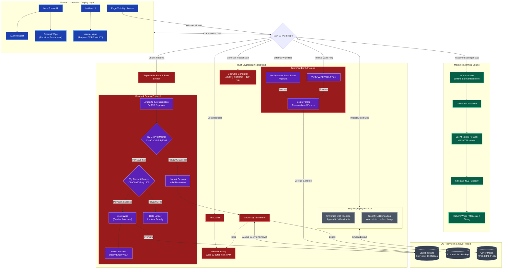

```mermaid
flowchart TB
    classDef frontend fill:#1e40af,stroke:#60a5fa,stroke-width:2px,color:#fff
    classDef backend fill:#991b1b,stroke:#f87171,stroke-width:2px,color:#fff
    classDef ml fill:#065f46,stroke:#34d399,stroke-width:2px,color:#fff
    classDef file fill:#374151,stroke:#9ca3af,stroke-width:2px,color:#fff
    classDef algo fill:#5b21b6,stroke:#a78bfa,stroke-width:2px,color:#fff
    classDef steg fill:#4b5563,stroke:#9ca3af,stroke-width:2px,color:#fff

    subgraph Frontend ["Frontend: Untrusted Display Layer"]
        UI_Lock["Lock Screen UI"]
        UI_Vault["In-Vault UI"]
        PageVis["Page Visibility Listener"]
        
        InputAuth["Auth Request"]
        InputWipeExt["External Wipe\n(Requires Passphrase)"]
        InputWipeInt["Internal Wipe\n(Requires 'WIPE VAULT')"]
        
        UI_Lock --> InputAuth
        UI_Lock --> InputWipeExt
        UI_Vault --> InputWipeInt
    end
    class UI_Lock,UI_Vault,PageVis,InputAuth,InputWipeExt,InputWipeInt frontend

    IPC{"Tauri v2 IPC Bridge"}
    
    Frontend <-->|"Commands / Data"| IPC
    PageVis -->|"Window Hidden"| IPC

    subgraph MLEngine ["Machine Learning Engine"]
        direction TB
        Sidecar["inference.exe\n(Offline Sidecar Daemon)"] --> Tokenizer["Character Tokenizer"]
        Tokenizer --> LSTM["LSTM Neural Network\n(ONNX Runtime)"]
        LSTM --> NLL["Calculate NLL / Entropy"]
        NLL --> Score["Return: Weak / Moderate / Strong"]
    end
    class Sidecar,Tokenizer,LSTM,NLL,Score ml

    IPC <-->|"Password Strength Eval"| Sidecar

    subgraph Backend ["Rust Cryptographic Backend"]
        direction TB
        
        RateLimit["Exponential Backoff Rate Limiter"]
        Diceware["Diceware Generator\n(OsRng CSPRNG + BIP-39)"]
        
        subgraph Protocol ["Unlock & Duress Protocol"]
            direction TB
            KDF["Argon2id Key Derivation\n64 MiB, 3 passes"]
            
            TryMaster{"Try Decrypt Master\nChaCha20-Poly1305"}
            TryDuress{"Try Decrypt Duress\nChaCha20-Poly1305"}
            
            NormalSession["Normal Session\nValid MasterKey"]
            GhostSession["Ghost Session\nDecoy Empty Vault"]
            WipeVaultDuress["Silent Wipe\n(Zeroize .blacksite)"]
            IncrementRL["Rate Limiter\nLockout Penalty"]
            
            KDF --> TryMaster
            TryMaster -- "Poly1305 Success" --> NormalSession
            TryMaster -- "Poly1305 Fail" --> TryDuress
            TryDuress -- "Poly1305 Success" --> WipeVaultDuress
            WipeVaultDuress --> GhostSession
            TryDuress -- "Poly1305 Fail" --> IncrementRL
        end
        class KDF,TryMaster,TryDuress,NormalSession,GhostSession,WipeVaultDuress,IncrementRL algo

        subgraph WipeEng ["Scorched Earth Protocol"]
            direction TB
            VerifyPass["Verify Master Passphrase\n(Argon2id)"]
            VerifyText["Verify 'WIPE VAULT' Text"]
            ExecWipe["Destroy Data\nRemove-Item / Zeroize"]
            
            VerifyPass -->|"Success"| ExecWipe
            VerifyText -->|"Success"| ExecWipe
        end
        class VerifyPass,VerifyText,ExecWipe algo
        
        subgraph StegEng ["Steganography Protocol"]
            direction TB
            EOF["Universal: EOF Injection\nAppend to Video/Audio"]
            LSB["Stealth: LSB Encoding\nWeave into Lossless Image"]
        end
        class EOF,LSB steg
        
        RateLimit --> KDF
        
        MemKey["MasterKey in Memory"]
        NormalSession --> MemKey
        
        LockVault["lock_vault"]
        Zeroize["ZeroizeOnDrop\nWipe 32 bytes from RAM"]
        LockVault --> Zeroize
        MemKey -. "Drop" .-> Zeroize
    end
    class RateLimit,Diceware,Protocol,MemKey,LockVault,Zeroize,WipeEng,StegEng backend

    IPC -->|"Lock Request"| LockVault
    IPC -->|"Unlock Request"| RateLimit
    IPC -->|"Generate Passphrase"| Diceware
    IPC -->|"External Wipe Req"| VerifyPass
    IPC -->|"Internal Wipe Req"| VerifyText
    IPC <-->|"Import/Export Steg"| StegEng

    subgraph Storage ["OS Filesystem & Cover Media"]
        VaultFile[("vault.blacksite\nEncrypted JSON Blob")]
        BSXFile[("Exported .bsx Backup")]
        CoverMedia[("Cover Media\n(JPG, MP4, PNG)")]
    end
    class VaultFile,BSXFile,CoverMedia file

    MemKey <-->|"Atomic Decrypt / Encrypt"| VaultFile
    MemKey -->|"Export"| BSXFile
    WipeVaultDuress -->|"Overwrite"| VaultFile
    ExecWipe -->|"Zeroize & Delete"| VaultFile
    StegEng <-->|"Embed/Extract"| CoverMedia
```
